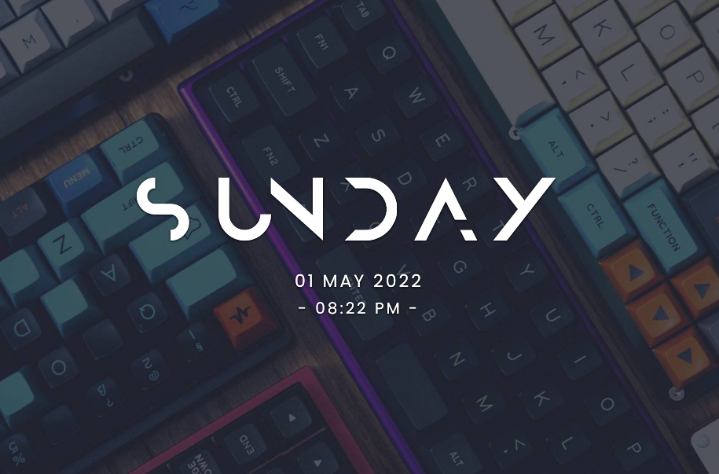
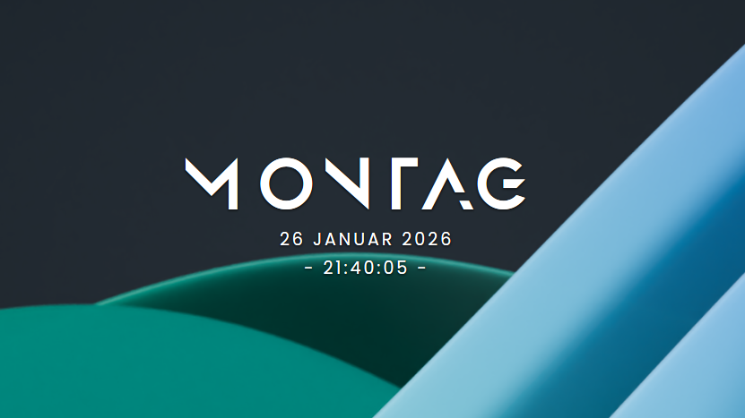

## Advanced Modern Clock for KDE
A modern looking clock widget!

  

## Features
- **Localization Support**: Display day and date names in your local language or keep them in English
  - Toggle "Use local name" for day names (e.g., "SAMSTAG" instead of "SATURDAY")
  - Toggle "Use local name" for date formats with localized month names
- **Customizable Appearance**: Adjust font sizes, letter spacing, and colors for each element
- **Flexible Time Format**:
  - Custom time format field supports Qt patterns (e.g., hh:mm:ss, h:mm:ss AP, HH:mm:ss)
  - Seconds in the format enable 1-second refresh; otherwise refreshes each minute
  - Custom format overrides the 12/24-hour toggle when filled
- **Show/Hide Elements**: Independently control visibility of day, date, and time
- **Custom Style Characters**: Add decorative characters around the time display

## Installation
### KDE Store (Preferred way)
1. Right click on the desktop
2. Click on "Enter Edit Mode "
3. Click on "Add Widgets"
4. Click on "Get New Widgets"
5. Search for "Advanced Modern Clock"
6. Click on "Install" and you're done!

### From this repository

1. Clone this repository  
`git clone https://github.com/vKaras1337/kde_modernclock && cd kde_modernclock/`  
2. Install using the script  
`kpackagetool6 -i package/ -t Plasma/Applet`

## Credits

This project is a fork of the original [Modern Clock](https://github.com/prayag2/kde_modernclock) by [Prayag Jain](https://github.com/prayag2). I would like to thank the original author for creating this beautiful clock widget and making it open source.

The localization feature was inspired by [JortonMV's fork](https://github.com/JortonMV/kde_modernclock/commit/25b87b540ea7903ab4d72174d2f77888d2a7a909). Thanks for the great idea!

The custom font selection feature was inspired by [lunar-d's fork](https://github.com/lunar-d/kde_modernclock_fonts/commit/9a881d1e560a2c30c3defde109aaae81fc27baef). Thanks for the implementation!

The custom time format feature was inspired by [YoannDev90's commit](https://github.com/YoannDev90/kde_modernclock/commit/3a737660982985f1aaf1ede2b374c1d2e4f1b8da), which adds seconds-aware refresh cadence.

This fork combines these improvements while maintaining the modern and clean design of the original.

## Disclaimer

I'm not a QML expert; the features were assembled with help from Google and AI to the best of my knowledge.
